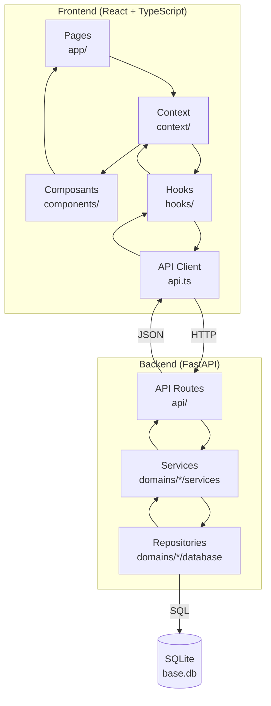

# AGENTS.md — Gestio V4

> **Point d'entrée pour TOUS les agents IA. À LIRE EN PREMIER.**

---

## ⚡ Début de session

1. **Lire ce fichier en entier**
2. **Demander sur quelle partie** du projet travailler
3. **Lire le fichier approprié** (voir ci-dessous)

---

## Quel agent ?

| Agent | Scope | Lire ce fichier |
|-------|-------|-----------------|
| **Claude / Minimax** | `backend/` uniquement | `.agent/skill-backend.md` |
| **Gemini / v0 / Lovable** | `frontend/` uniquement | `.agent/skill-frontend.md` |

---

## 🎯 Scope des agents (TRES IMPORTANT)

### Règle d'or : **1 agent = 1 dossier**

- **Agent Frontend** (Gemini, v0, Lovable) → **SEULEMENT** dans `frontend/`
- **Agent Backend** (Claude, Minimax) → **SEULEMENT** dans `backend/`

### Si un agent a besoin de changements dans l'autre partie :

**L'agent DOIT écrire un prompt à l'autre agent** pour expliquer les changements nécessaires.

**Exemple :**
> L'agent frontend constate que l'API manque un endpoint → Il **ne modifie PAS** le backend, il **écrit** à l'agent backend :
> 
> *"Bonjour, j'ai besoin d'un nouvel endpoint GET /api/transactions/summary qui retourne le total des dépenses par catégorie. Peux-tu l'ajouter dans backend/api/ ?"*

---

## ⚠️ Avant de modifier du code (OBLIGATOIRE)

### 1. Lire le README du dossier concerné

**OBLIGATOIRE** : Lire le fichier `README.md` du dossier concerné avant toute modification.

Exemple :
- Pour modifier `backend/domains/transactions/` → lire `backend/domains/transactions/README.md`
- Pour modifier `frontend/src/app/transactions/` → lire `frontend/README.md`

### 2. Comprendre le Data Flow

**OBLIGATOIRE** : Avant de modifier un fichier, comprendre :
- **Comment les données entrent** (input)
- **Comment les données sortent** (output)
- **Quels services/API sont appelés**

Chercher s'il existe un fichier `LOGIC_FLOW.md` ou une documentation dans le README du dossier.

### 📍 Emplacements des LOGIC_FLOW (API)

| Module | Emplacement |
|--------|--------------|
| Dashboard | `backend/api/dashboard/LOGIC_FLOW.md` |
| Transactions | `backend/api/transactions/LOGIC_FLOW.md` |
| Attachments | `backend/api/attachments/LOGIC_FLOW.md` |
| OCR | `backend/api/ocr/LOGIC_FLOW.md` |
| Echeances | `backend/api/echeances/LOGIC_FLOW.md` |

### 3. Si le Logic Flow n'existe pas

**Créer un fichier `LOGIC_FLOW.md`** dans le dossier concerné avec :
- Diagramme mermaid du flux de données
- Description des entrées/sorties
- API endpoints utilisés

---

## ⚠️ Effet papillon

**AVANT une modification, réfléchir à :**

1. Cette modification affecte-t-elle d'autres parties ?
2. Le fichier importe-t-il d'autres modules ?
3. Faut-il mettre à jour les tests ? Les types ? La documentation ?
4. Respecte-t-elle les règles DDD ? (domaines isolés, pas de dépendances circulaires)

### 🔄 Synchronisation Backend ↔ Frontend

**Règle** : Si tu modifies un **modèle Pydantic** dans le backend, tu DOIS aussi modifier les **types TypeScript** correspondants dans `frontend/src/api.ts`.

| Fichier modifié | Fichier à synchroniser |
|-----------------|------------------------|
| `backend/.../model.py` (Pydantic) | `frontend/src/api.ts` (TypeScript) |
| `backend/api/*.py` (nouveau endpoint) | `frontend/src/api.ts` (nouvelle méthode) |

**Exemple** :
> Tu ajoutes un champ `description` au modèle Transaction → Tu DOIS ajouter `description?: string` à l'interface Transaction dans `frontend/src/api.ts`

---

## 📁 Structure

```
gestion-financiere/
├── backend/           # FastAPI + SQLite (port 8001)
│   ├── api/          # Endpoints REST
│   ├── domains/      # Logique métier (DDD)
│   ├── shared/       # Composants partagés
│   └── config/      # Configuration
├── frontend/         # React + TypeScript + Tailwind (port 5173)
│   └── src/app/     # Pages
└── tests/           # Tests pytest
```

---

## 🔀 Architecture globale



---

## 🔌 Ports

| Service | Port |
|---------|------|
| Backend (FastAPI) | 8002 |
| Frontend (Next.js) | 3000 |

---

## ⚠️ Règle de taille

**INTERDIT :** Tout fichier dépassant **200 lignes**.

---

## 📝 Fin de session

**SI** vous avez fait une grande refactorisation ou ajouté/supprimé beaucoup de fonctionnalités :

1. **Mettre à jour les READMEs** des dossiers concernés
2. **Créer ou mettre à jour** le fichier `LOGIC_FLOW.md` si le flux de données a changé
3. **Vérifier** que la documentation reflète les nouvelles structures