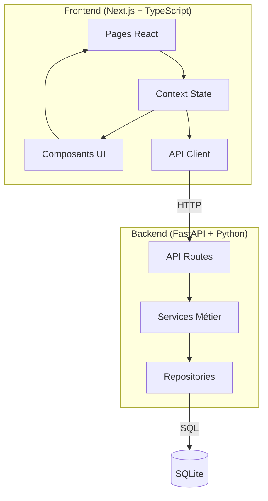
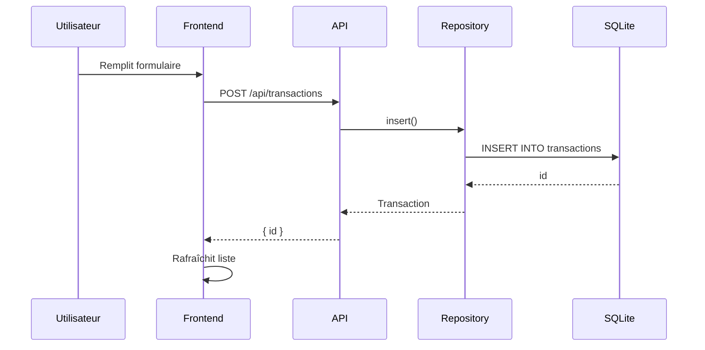
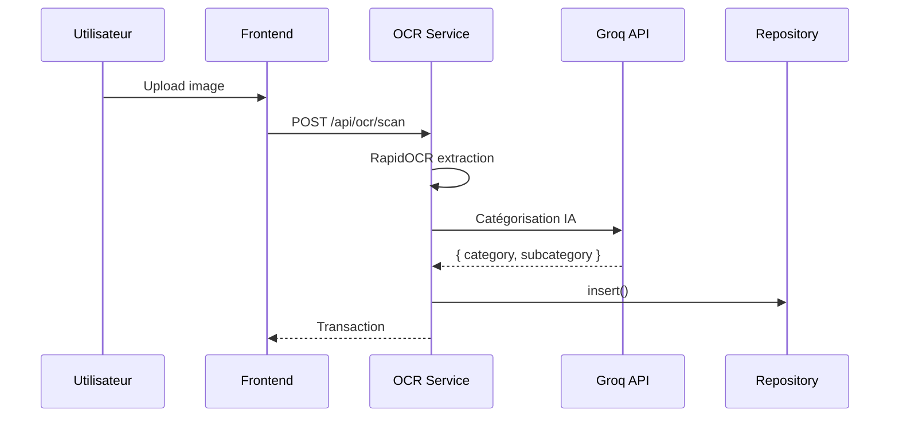
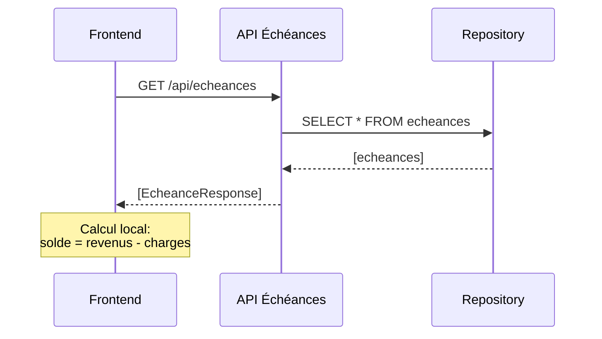

# Architecture — Gestio V4

> Document de référence pour comprendre et maintenir le projet sans tout lire.

## Vue d'Ensemble



## Ports

| Service | Port | Description |
|---------|------|-------------|
| Frontend | 3000 | Next.js (développement) |
| Backend | 8002 | FastAPI |

## Structure des Données

### Base SQLite(definie dans `backend/config/paths.py`)

```
finances.db
├── transactions      # Dépenses et revenus
├── echeances         # Échéances récurrentes
├── attachments       # Fichiers joints
├── budgets          # Limites mensuelles
└── goals            # Objectifs financiers
```

### Dossiers Importants

| Dossier | Rôle |
|---------|-------|
| `backend/config/` | Chemins (DATA_DIR, SORTED_DIR, etc.) |
| `backend/api/` | Endpoints REST |
| `backend/domains/` | Logique métier (DDD) |
| `backend/shared/` | Composants partagés |
| `frontend/src/app/` | Pages Next.js |
| `frontend/src/components/` | Composants React |

## Flux de Données Courants

### 1. Ajouter une transaction



### 2. Scanner un ticket



### 3. Calculer le solde échéances



## Endpoints Principaux

### Transactions

| Méthode | Endpoint | Description |
|---------|----------|-------------|
| `GET` | `/api/transactions/` | Liste transactions |
| `POST` | `/api/transactions/` | Créer transaction |
| `PUT` | `/api/transactions/{id}` | Modifier transaction |
| `DELETE` | `/api/transactions/{id}` | Supprimer |

### Échéances

| Méthode | Endpoint | Description |
|---------|----------|-------------|
| `GET` | `/api/echeances/` | Liste échéances |
| `GET` | `/api/echeances/calendar` | Occurrences calendrier |
| `POST` | `/api/echeances/` | Créer échéance |

### Budgets

| Méthode | Endpoint | Description |
|---------|----------|-------------|
| `GET` | `/api/budgets/` | Liste budgets |
| `POST` | `/api/budgets/` | Créer budget |
| `GET` | `/api/budgets/salary-plans` | Plans de salaire |

### OCR

| Méthode | Endpoint | Description |
|---------|----------|-------------|
| `POST` | `/api/ocr/scan` | Scanner ticket |
| `POST` | `/api/ocr/scan-income` | Scanner fiche de paie |

## Règles Importantes

### 1. Chemins dynamiques

**JAMAIS** de chemins en dur :
- Base de données → `backend/config/paths.py` → `DATA_DIR`
- Dossiers scan → `SORTED_DIR`, `REVENUS_TRAITES`

### 2. Modèles同步

Si tu modifies un modèle Pydantic backend →同步 vers TypeScript frontend :
- `backend/domains/transactions/database/model.py` ↔ `frontend/src/api.ts`

### 3. Taille des fichiers

**MAX 200 lignes** par fichier (voir `AGENTS.md`)

## Dépannage

### Le backend ne démarre pas

```bash
# La DB est dans platformdirs.user_data_dir("Gestio")
# Vérifier que SQLite existe
ls "$(python -c "import platformdirs; print(platformdirs.user_data_dir('Gestio'))")"

# Vérifier les logs
uv run uvicorn backend.main:app --reload --log-level debug
```

### Le frontend ne charge pas les données

1. Vérifier que le backend tourne sur le port 8002
2. Vérifier la console navigateur (erreurs CORS)
3. Vérifier `frontend/src/api.ts` → `BASE_URL`

### Les tests échouent

```bash
# Lancer les tests (TOUJOURS depuis la racine du projet)
uv run pytest tests/ -v

# Tests spécifiques
uv run pytest tests/test_api/ -v

# Un test unique
uv run pytest tests/test_transactions/test_repository.py::test_insert -v
```

### Erreur "base.db not found"

```bash
# Créer la base
python backend/scripts/migrate_database.py
```

## Ajouter une Feature

### 1. Backend (nouvel endpoint)

```python
# backend/api/mon_module/mon_fichier.py
from fastapi import APIRouter

router = APIRouter(prefix="/api/mon_module", tags=["mon_module"])

@router.get("/")
async def get_data():
    return ["data"]
```

### 2. Enregistrer le router

```python
# backend/main.py
from backend.api.mon_module import router as mon_router
app.include_router(mon_router)
```

### 3. Frontend (nouveau hook)

```typescript
// frontend/src/hooks/useMaFeature.ts
export function useMaFeature() {
  const { data, loading } = useSWR('/api/mon_module', fetcher)
  return { data, loading }
}
```

### 4. Frontend (nouvelle page)

```typescript
// frontend/src/app/mon-module/page.tsx
export default function MaPage() {
  const { data } = useMaFeature()
  return <div>{data}</div>
}
```

## Fichiers Clés

| Fichier | Rôle |
|---------|------|
| `backend/main.py` | Point d'entrée FastAPI |
| `backend/config/paths.py` | Chemins vers données |
| `backend/shared/database/connection.py` | Connexion SQLite |
| `frontend/src/api.ts` | Client API frontend |
| `frontend/src/context/FinancialDataContext.tsx` | État global |

## Pour Aller Plus Loin

Voir les LOGIC_FLOW par module :
- `backend/domains/dashboard/LOGIC_FLOW.md`
- `backend/domains/transactions/LOGIC_FLOW.md`
- `backend/domains/echeances/LOGIC_FLOW.md`
- `backend/domains/budgets/LOGIC_FLOW.md`
- `backend/domains/ocr/LOGIC_FLOW.md`
- `backend/domains/attachments/LOGIC_FLOW.md`
- `backend/domains/goals/LOGIC_FLOW.md`
- `frontend/src/app/budgets/LOGIC_FLOW.md`
- `frontend/src/app/echeances/LOGIC_FLOW.md`
- 
