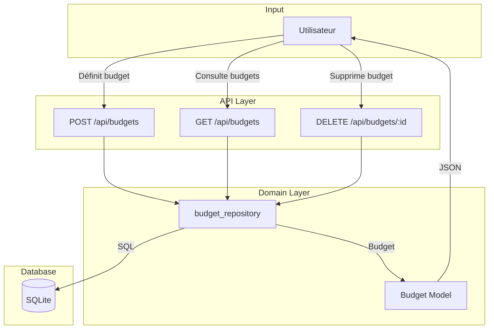

# Budgets API - LOGIC FLOW

## Overview

Gestion des budgets mensuels par catégorie. Permet de définir un montant maximum par catégorie et de suivre les dépenses.

## Data Flow



## API Endpoints

| Méthode | Endpoint | Description |
|---------|----------|-------------|
| `GET` | `/api/budgets/` | Liste tous les budgets |
| `POST` | `/api/budgets/` | Créer ou mettre à jour un budget |
| `DELETE` | `/api/budgets/:id` | Supprimer un budget |

## Input / Output

### GET /api/budgets/

**Response:**
```json
[
  {
    "id": 1,
    "categorie": "Alimentation",
    "montant_max": 500.0
  }
]
```

### POST /api/budgets/

**Request:**
```json
{
  "categorie": "Alimentation",
  "montant_max": 500.0
}
```

**Response:** Budget créé/mis à jour

### DELETE /api/budgets/:id

**Response:**
```json
{
  "message": "Budget supprimé"
}
```

## Database

Table: `budgets`

| Colonne | Type | Description |
|---------|------|-------------|
| id | INTEGER | PK auto-increment |
| categorie | TEXT | Catégorie principale |
| montant_max | REAL | Budget mensuel maximum |

## Usage

Typical use case: Allow users to set spending limits per category and track if they're over budget.
