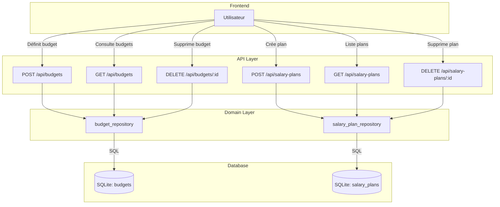

# Budgets API - LOGIC FLOW

## Overview

Gestion des budgets mensuels par catégorie et des Salary Plans (plans de salaire).

## Fichiers concernés

```
backend/api/budgets/
├── budgets.py          # Endpoints REST (budgets + salary-plans)
└── ...

backend/domains/budgets/
├── model.py            # Modèle Pydantic Budget
├── repository.py       # Accès données SQLite
├── model_salary_plan.py   # Modèle SalaryPlan (Pydantic)
└── repository_salary_plan.py # Accès SalaryPlan (SQLite)
```

## Data Flow



## API Endpoints

### Budgets

| Méthode | Endpoint | Description |
|---------|----------|-------------|
| `GET` | `/api/budgets/` | Liste tous les budgets |
| `POST` | `/api/budgets/` | Créer ou mettre à jour un budget |
| `DELETE` | `/api/budgets/:id` | Supprimer un budget |

### Salary Plans

| Méthode | Endpoint | Description |
|---------|----------|-------------|
| `GET` | `/api/salary-plans/` | Liste tous les plans |
| `POST` | `/api/salary-plans/` | Créer ou mettre à jour un plan |
| `DELETE` | `/api/salary-plans/:id` | Supprimer un plan |

## Format de données

### Budget

```json
{
  "id": 1,
  "categorie": "Alimentation",
  "montant_max": 500.0
}
```

### SalaryPlan

```json
{
  "id": 1,
  "nom": "Plan Principal",
  "reference_salary": 3000.0,
  "is_active": true,
  "items": [
    {
      "categorie": "Loyer",
      "montant": 800,
      "type": "expense"
    },
    {
      "categorie": "Salaire",
      "montant": 3000,
      "type": "income"
    }
  ]
}
```

## Strategic Balance (Solde Échéances)

Le calcul du "Solde Échéances" se fait côté **frontend** (`page.tsx`) en combinant :

1. **Salary Plan** (`reference_salary`) → Revenu de référence
2. **Échéances actives** → Charges fixes et revenus récurrents
3. **Calcul** : `fixedChargesBalance = totalStrategicIncome - totalStrategicExpense`

### Logique backend (echeances.py)

L'API `/api/echeances/` retourne :

```typescript
interface EcheanceResponse {
  id: string;
  amount: number;
  type: "expense" | "income";
  status: "paid" | "pending" | "overdue";
  // ...
}
```

**Important** : Les échéances avec `status === 'paid'` sont incluses dans le calcul car elles représentent des charges/revenus du mois en cours.

## Database

### Table: budgets

| Colonne | Type | Description |
|---------|------|-------------|
| id | INTEGER | PK auto-increment |
| categorie | TEXT | Catégorie principale |
| montant_max | REAL | Budget mensuel maximum |

### Table: salary_plans

| Colonne | Type | Description |
|---------|------|-------------|
| id | INTEGER | PK auto-increment |
| nom | TEXT | Nom du plan |
| reference_salary | REAL | Salaire de référence |
| is_active | INTEGER | 1 = actif |

### Table: salary_plan_items

| Colonne | Type | Description |
|---------|------|-------------|
| id | INTEGER | PK auto-increment |
| plan_id | INTEGER | FK vers salary_plans |
| categorie | TEXT | Catégorie |
| montant | REAL | Montant alloué |
| type | TEXT | "expense" ou "income" |

## Effet Papillon

| Fichier modifié | Impact |
|-----------------|--------|
| `budgets.py` | Frontend `/budgets`, PlanningSummary |
| `model.py` | Format des budgets |
| `model_salary_plan.py` | Format des salary plans |
| `repository_salary_plan.py` | Accès données salary plans |
| `/api/echeances/` | Calcul du strategic balance |

## Frontend associé

- `frontend/src/app/budgets/page.tsx` - Page principale
- `frontend/src/components/budgets/PlanningSummary.tsx` - Résumé stratégique
- `frontend/src/components/budgets/SalaryPlanSetup.tsx` - Configuration du plan
- `frontend/src/api.ts` - `api.getBudgets()`, `api.getSalaryPlans()`, `api.saveSalaryPlan()`
