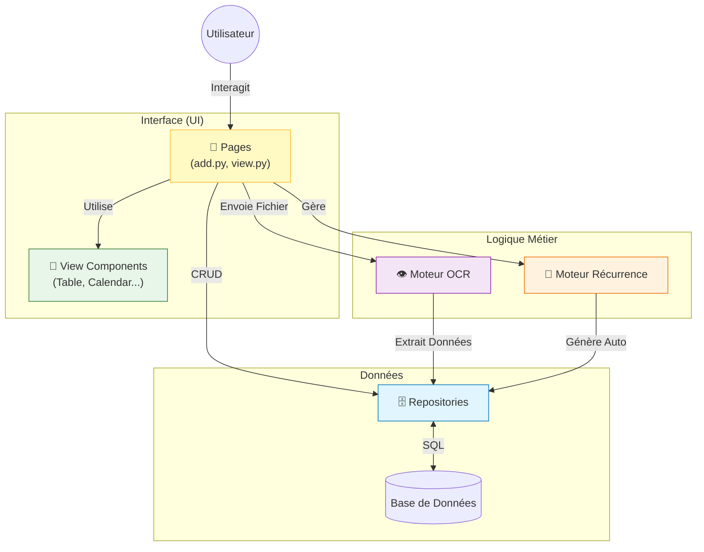

# 💰 Domaine Transactions

Bienvenue dans le centre nerveux de l'application. Ce module gère **toutes** les opérations financières (dépenses,
revenus, virements).

## 🗺️ Carte du Module

Ce dossier est divisé en sous-modules spécialisés. Cliquez sur les liens pour accéder à la documentation détaillée de
chaque partie :

| Dossier           | Rôle                                                     | Documentation                             |
|:------------------|:---------------------------------------------------------|:------------------------------------------|
| **`database/`**   | **Données** (Schéma SQL, Repositories)                   | [🗄️ Lire la doc](database/README.md)     |
| **`services/`**   | **Logique Métier** (Transaction, Attachment)             | [⚙️ Lire la doc](services/README.md)     |
| **`ocr/`**        | **Intelligence Artificielle** (Scan tickets/PDF)         | [👁️ Lire la doc](ocr/services/README.md) |

---

## 🏗️ Architecture Globale

Comment tout cela fonctionne ensemble ? Voici le flux de données principal :

## 🚀 Guide Rapide

### Je veux modifier...

- **Le service de gestion des transactions ?**
  👉 [`services/transaction_service.py`](services/transaction_service.py) (Doc: [
  `services/README.md`](services/README.md))

- **La détection des prix sur les tickets ?**
  👉 [`ocr/services/pattern_manager.py`](ocr/services/pattern_manager.py) (Doc: [
  `ocr/services/README.md`](ocr/services/README.md))

- **Le modèle de données d'une transaction ?**
  👉 [`database/model.py`](database/model.py) (Doc: [`database/README.md`](database/README.md))
