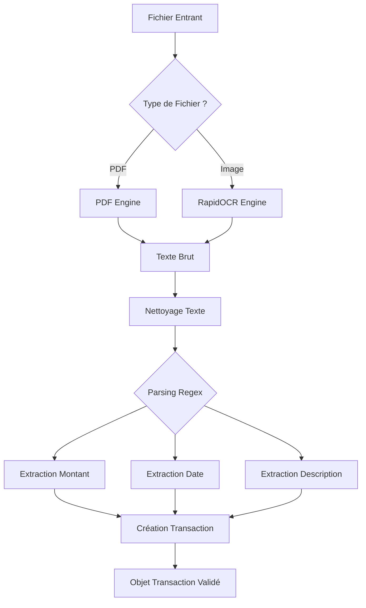

# Service d'Orchestration OCR

Ce module orchestre le flux complet de transformation : **Fichier Brut** $\to$ **Donnée Structurée (Transaction)**.

## 🔄 Flux de Traitement (Pipeline)

Le `OCRService` agit comme un chef d'orchestre. Voici les étapes détaillées :



## 🧠 Composants Clés

### `OCRService` (`ocr_service.py`)

Point d'entrée unique. Il décide quel moteur utiliser et comment assembler les résultats.

### `PatternManager` (`pattern_manager.py`)

Gère les expressions régulières (Regex) pour identifier :

- **Montants** : `12,50 €`, `12.50`, etc.
- **Dates** : `12/12/2023`, `12-DEC-23`, etc.

## ⚠️ Gestion des Erreurs

- **Fichier Illisible** : Exception levée si le moteur ne retourne aucun texte.
- **Parsing Échoué** : Si aucun montant n'est trouvé, une erreur explicite est remontée à l'UI pour demander une saisie
  manuelle.
- **Fallback** : Si la date n'est pas trouvée, la date du jour est proposée par défaut.

---

## 🔧 Quick Reference

### Endpoints API

| Méthode | Endpoint | Description |
|---------|----------|-------------|
| `POST` | `/api/ocr/scan` | Scanner ticket (image) |
| `POST` | `/api/ocr/scan-income` | Scanner fiche de paie (PDF) |

### Erreurs courantes

| Erreur | Cause | Solution |
|--------|-------|----------|
| `Format non supporté` | Extension non acceptée | Utiliser jpg, png, bmp, tiff, webp, pdf |
| `pdfminer.six non installé` | Dépendance manquante | `uv add pdfminer.six` |
| `GROQ_API_KEY absente` | Pas de clé API | Catégorisation IA désactivée |
| `Invalid API Key` | Clé Groq invalide | Vérifier la clé dans .env |

### Debug OCR

```python
# Tester l'extraction
from backend.domains.transactions.ocr.services.ocr_service import get_ocr_service
ocr = get_ocr_service()
tx = ocr.process_ticket("chemin/vers/ticket.jpg")
print(tx.montant, tx.categorie)
```

### Configuration

- Clé API Groq : `.env` → `GROQ_API_KEY`
- Patterns montant/date : `ocr/services/pattern_manager.py`
