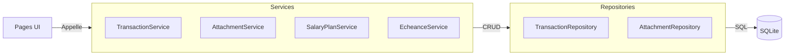

# Services (Logique Métier)

Ce dossier contient la **couche service** qui fait le lien entre les Pages (UI) et les Repositories (Données).

## 🎯 Rôle

Les Services encapsulent la **logique métier** :
- Transformation de données (mapping, conversion)
- Appels aux Repositories
- Logique complexe (calculs, aggregations)
- Orchestration de plusieurs opérations

## 📂 Contenu

| Fichier                      | Responsabilité                                      |
|------------------------------|-----------------------------------------------------|
| **`transaction_service.py`**  | Lecture/filtrage des transactions, mapping DB↔Model |
| **`attachment_service.py`**  | Gestion des fichiers joints (tickets, PDF)          |
| **`salary_plan_service.py`** | Gestion des plans de salaire et allocation          |
| **`echeance_service.py`**    | Gestion des échéances et backfill                  |

## 🔄 Flux de données



## 📋 Méthodes par Service

### TransactionService
- `get_transaction_by_id(tx_id)` → Transaction
- `get_filtered_transactions_df(start, end, category)` → pd.DataFrame

### SalaryPlanService
- `load_salary_plan(filename)` → Dict
- `validate_salary_plan(plan)` → bool
- `apply_salary_split(net_amount, payroll_date, plan)` → List[Transaction]
- `get_available_plans()` → List[str]

### EcheanceService
- `calculate_next_occurrence(echeance)` → date
- `backfill_echeances(months_back)` → int
- `cleanup_past_echeances()` → int
- `refresh_echeances()` → None

### AttachmentService
- `add_attachment(...)` → bool
- `get_attachments(transaction_id)` → List[TransactionAttachment]
- `delete_attachment(attachment_id)` → bool
- `archive_income_file(...)` → str

## ⚡ Point important

Les Services **ne font pas de SQL direct** (sauf pour la récurrence qui est un cas spécial). Ils délèguent tout au Repository.

---

## 🔧 Quick Reference

### Erreurs courantes

| Erreur | Cause | Solution |
|--------|-------|----------|
| `Au moins une allocation est requise` | `items` vide ou mal formaté | Vérifier que `plan.items` contient des allocations |
| `Allocations >= 100%` | Total percent > 100 | Ajouter une catégorie reliquat (ex: Épargne) |
| `Catégorie non trouvée` | Catégorie absente de categories.yaml | Warning seulement, continue |
| `Fichier orphelin` | Attachment ajouté mais pas en DB | Supprimer le fichier physique |

### Validation Salary Plan

```python
# Format attendu pour validation
plan = {
    "allocations": [
        {"category": "Alimentation", "value": 50, "type": "percent"},
        ...
    ]
}
validate_salary_plan(plan)  # Lève SalaryPlanError si invalide
```

### Debug Attachment

```python
# Trouver un fichier par nom
attachment_service.find_file("mon_fichier.jpg")

# Récupérer le contenu
content, filename, mime = attachment_service.get_file_content(attachment_id)
```

Voir aussi :
- [README principal du domaine](../README.md)
- [Database README](../database/README.md)
