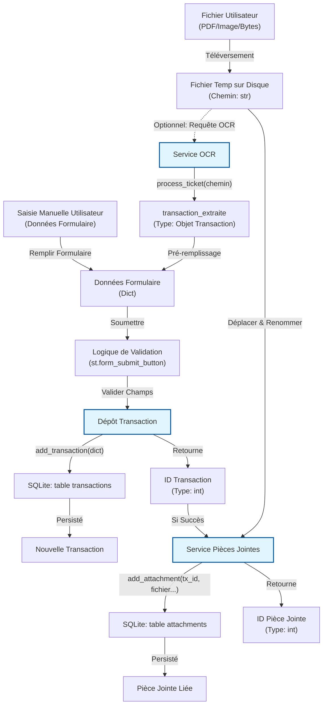

# Flux Logique - Page d'Ajout de Transaction

## Vue d'ensemble

Cette page gère la création de nouvelles transactions, soit manuellement, soit via OCR (Scan de tickets).

## Structures de Données

| Donnée             | Type                     | Description                                                                              |
|:-------------------|:-------------------------|:-----------------------------------------------------------------------------------------|
| **Fichier Temp**   | `str` (Chemin)           | Chemin vers le fichier téléversé temporaire avant traitement.                            |
| **Données Form**   | `dict`                   | Dictionnaire contenant les champs de transaction (`montant`, `date`, `catégorie`, etc.). |
| **Tx Extraite**    | `Transaction` (Pydantic) | Objet intermédiaire retourné par le Service OCR.                                         |
| **ID Transaction** | `int`                    | Clé primaire de la transaction nouvellement créée.                                       |

## Résumé de la Logique IA

1. **Acquisition d'Entrée**: L'utilisateur fournit un fichier (PDF/Image) ou saisit les détails manuellement.
2. **Traitement OCR (Optionnel)**: Si un fichier est téléversé, `OCRService.process_ticket` l'analyse et retourne un
   objet `Transaction` pour pré-remplir le formulaire.
3. **Validation Utilisateur**: L'utilisateur revoit/modifie le formulaire. À la soumission, les données sont validées (
   champs requis, types).
4. **Persistance Transaction**: Les données validées (en `dict`) sont envoyées à
   `TransactionRepository.add_transaction`. Cela insère une ligne dans la table `transactions` et retourne le nouvel
   `id`.
5. **Gestion Pièce Jointe**: Si un fichier était associé :
    * `AttachmentService` reçoit le nouveau `transaction_id`.
    * Il déplace le fichier vers le stockage permanent.
    * Il insère un enregistrement dans la table `transaction_attachments` liant le fichier à la transaction.
