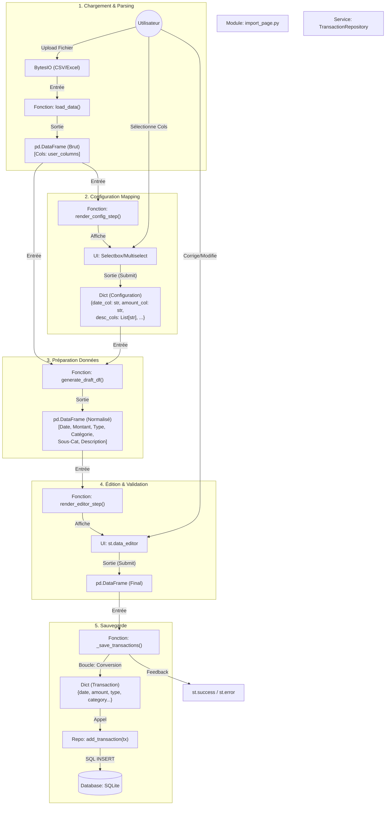

# Flux Logique - Page d'Import (Refactorisé)

## Vue d'ensemble

Ce document détaille le flux de données pour l'import de transactions, en précisant pour chaque étape : la fonction
responsable, les données en entrée, et les données en sortie.

## Diagramme de Flux Détaillé

## Dictionnaire des Données

| Donnée         | Type Python    | Description                                                                                                                      |
|:---------------|:---------------|:---------------------------------------------------------------------------------------------------------------------------------|
| **FileObj**    | `UploadedFile` | Objet fichier brut fourni par Streamlit.                                                                                         |
| **RawDF**      | `pd.DataFrame` | DataFrame tel que lu par Pandas (colonnes hétérogènes).                                                                          |
| **ConfigDict** | `dict`         | Contient les choix de mapping de l'utilisateur. Exemple : `{'date_col': 'Date Opération', 'desc_cols': ['Libellé', 'Réf'], ...}` |
| **DraftDF**    | `pd.DataFrame` | DataFrame standardisé avec les colonnes attendues par l'application (`Date`, `Montant`, `Type`...), mais pas encore validé.      |
| **FinalDF**    | `pd.DataFrame` | DataFrame après modifications manuelles de l'utilisateur dans le `data_editor`. C'est la source de vérité pour l'import.         |
| **TxDict**     | `dict`         | Dictionnaire unique représentant une transaction, conforme au schéma de la base de données.                                      |

## Responsabilités des Fonctions

| Fonction             | Responsabilité                                                                                                | Entrées                | Sorties                     |
|:---------------------|:--------------------------------------------------------------------------------------------------------------|:-----------------------|:----------------------------|
| `load_data`          | Lire le fichier (CSV/Excel), gérer les erreurs d'encodage, nettoyer les noms de colonnes.                     | `UploadedFile`         | `pd.DataFrame`              |
| `render_config_step` | Afficher les sélecteurs de colonnes, valider que Date/Montant sont présents.                                  | `pd.DataFrame`         | `dict` (Config) ou `None`   |
| `generate_draft_df`  | Appliquer le mapping, parser les dates/montants, fusionner les colonnes description/sous-cat.                 | `pd.DataFrame`, `dict` | `pd.DataFrame`              |
| `render_editor_step` | Afficher le tableau interactif, configurer les types de colonnes (Date, Selectbox), déclencher la sauvegarde. | `pd.DataFrame`         | - (Appelle sauvegarde)      |
| `_save_transactions` | Itérer sur le DataFrame final, convertir chaque ligne en Transaction, appeler le Repository.                  | `pd.DataFrame`         | `(int success, int errors)` |
