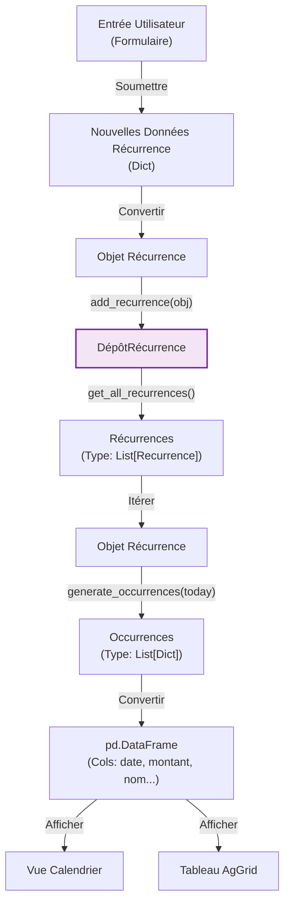

# Flux Logique - Page de Gestion des Récurrences

## Vue d'ensemble

Cette page gère les transactions récurrentes (abonnements, salaires) et visualise les occurrences futures.

## Structures de Données

| Donnée               | Type               | Description                                                                            |
|:---------------------|:-------------------|:---------------------------------------------------------------------------------------|
| **Liste Récurrence** | `List[Recurrence]` | Liste des modèles Pydantic représentant les récurrences actives.                       |
| **Occurrences**      | `List[Dict]`       | Transactions virtuelles générées (dictionnaires) basées sur la fréquence et les dates. |
| **DF Affichage**     | `pd.DataFrame`     | DataFrame Pandas construit depuis les occurrences pour les composants UI.              |

## Résumé de la Logique IA

1. **Chargement de Données**: La page récupère toutes les définitions de récurrence actives depuis
   `RecurrenceRepository` sous forme de `List[Recurrence]`.
2. **Moteur de Projection**: Pour chaque objet récurrence, la méthode `generate_occurrences(current_date)` est appelée.
   Cela calcule toutes les dates futures (ex: 12 prochains mois) basées sur la fréquence (mensuelle, annuelle).
3. **Transformation de Données**: La liste résultante d'occurrences virtuelles (dictionnaires) est convertie en un
   `pd.DataFrame`.
4. **Visualisation**: Ce DataFrame est utilisé pour rendre :
    * Une Vue Calendrier (montrant quand les dépenses tombent).
    * Un Tableau (listant les détails).
5. **Flux de Création**: Les nouvelles récurrences sont créées via un formulaire, instanciées comme objets `Recurrence`,
   et persistées via `RecurrenceRepository.add_recurrence`.
