# Logic Flow - Dashboard (View Transaction)

## Overview

The central dashboard for visualizing financial health, consolidating historical transactions and future recurrence
projections.

```mermaid
graph TD
    %% Sources
    TxService[TransactionService]
    RecRepo[RecurrenceRepository]

    %% Data Loading
    TxService -->|"get_filtered_transactions_df()"| HistDF["Historical Transactions<br/>(Type: pd.DataFrame)"]
    RecRepo -->|"get_all_recurrences()"| RecList["Recurrences<br/>(Type: List[Recurrence])"]

    %% Projection Logic
    RecList -->|"generate_occurrences(today)"| VirtualDicts["Virtual Occurrences<br/>(Type: List[Dict])"]
    VirtualDicts -->|"pd.DataFrame()"| FutureDF["Future Transactions<br/>(Type: pd.DataFrame)"]

    %% Data Merging
    HistDF -->|"pd.concat"| GlobalDF["Global DataFrame<br/>(All Transactions)"]
    FutureDF -->|"pd.concat"| GlobalDF

    %% User Interaction / Filtering
    UserFilters["User Filters<br/>(Date Range, Categories)"] -->|"Apply Filters"| FilteredDF["Filtered DataFrame<br/>(Type: pd.DataFrame)"]

    %% Visualization
    FilteredDF -->|Calculate| KPIs["KPI Metrics<br/>(Total, Revenu, Dépense)"]
    FilteredDF -->|"_build_hierarchy()"| SunburstStructure["Sunburst Dict<br/>(Hierarchy for Charts)"]
    FilteredDF -->|Render| EvolutionChart[Evolution Chart]
    FilteredDF -->|Render| TxTable["Transaction Table<br/>(Editable)"]

    %% Update Logic (Inline)
    TxTable -.->|"User Edit"| UpdateRequest["Update Request<br/>(Dict with ID)"]
    UpdateRequest -->|"update_transaction(dict)"| RepoUpdate[TransactionRepository]
    RepoUpdate -->|Refresh| TxService

    classDef data fill:#e0f2f1,stroke:#00695c,stroke-width:2px;
    class HistDF,FutureDF,GlobalDF,FilteredDF data;
    classDef service fill:#fff3e0,stroke:#e65100,stroke-width:2px;
    class TxService,RecRepo,RepoUpdate service;
```

## Data Types / Structures

| Data              | Type           | Description                                                                                                   |
|:------------------|:---------------|:--------------------------------------------------------------------------------------------------------------|
| **Historical DF** | `pd.DataFrame` | Raw transactions from DB. Columns: `id`, `date`, `amount`, `category`, `type`...                              |
| **Future DF**     | `pd.DataFrame` | Projected transactions generated from active recurrences.                                                     |
| **Global DF**     | `pd.DataFrame` | Combined dataset used for all visualizations.                                                                 |
| **Sunburst Dict** | `dict`         | Nested dictionary structure `{label, value, children: []}` specifically formatted for the Sunburst component. |

## AI Logic Summary

1. **Dual Data Retrieval**: The dashboard pulls two distinct datasets:
    * **Historical**: Real transactions from `TransactionRepository` (returned as a DataFrame).
    * **Future**: Projected transactions generated from `RecurrenceRepository` (converted to a DataFrame).
2. **Unification**: These two DataFrames are concatenated into `GlobalDF`. This allows the dashboard to show a
   continuous timeline from past to future.
3. **Filtering**: User inputs (Date Range slider, Category dropdowns) are applied to `GlobalDF` to produce `FilteredDF`.
   All downstream metrics depend on this filtered set.
4. **Visualization Rendering**:
    * **KPIs**: Sums and aggregates are calculated from `FilteredDF`.
    * **Sunburst**: A hierarchical dictionary is built from `FilteredDF` groupings.
    * **Data Table**: Displays `FilteredDF` and supports inline editing.
5. **Edit Cycle**: If a user edits a cell in the table, an update request (Dict) is sent to
   `TransactionRepository.update_transaction` on the backend, triggering a refresh of the Historical data.
