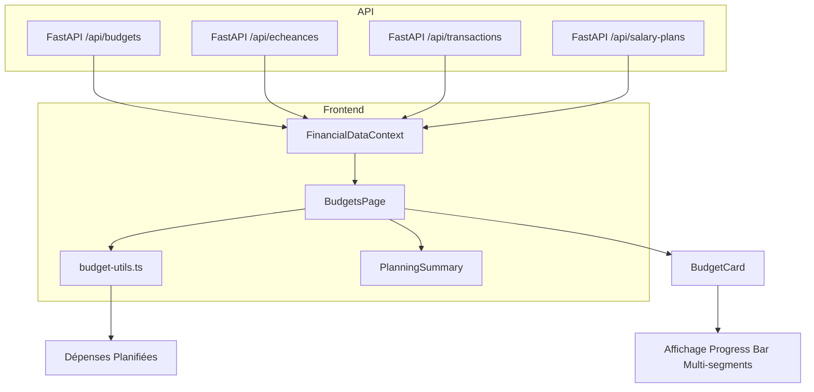
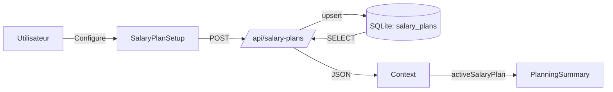

# Logic Flow — Budgets

Ce document décrit comment les données budgétaires et les prévisions sont gérées dans l'application.

## Fichiers concernés

```
frontend/src/app/budgets/
├── page.tsx                    # Page principale
├── PlanningSummary.tsx         # Composant résumé stratégique
├── BudgetCard.tsx              # Carte individuelle d'un budget
├── BudgetForm.tsx              # Formulaire de création/édition
├── SalaryPlanSetup.tsx         # Configuration du plan de salaire
├── StrategyCard.tsx            # Carte de stratégie (déficit)
└── AllocationItem.tsx          # Élément d'allocation

frontend/src/lib/
├── budget-utils.ts             # Fonctions de calcul (getMonthOccurrences, calculatePlannedExpenses, etc.)
└── categories.ts               # Styles des catégories
```

## Flux de Données



## Strategic Balance (Solde Échéances)

Le "Solde Échéances" est calculé dans `page.tsx` (lignes 199-232) :

1. **Récupération des échéances actives** (y compris 'paid')
2. **Calcul des occurrences** pour le mois en cours via `getMonthOccurrences()`
3. **Séparation** par type :
   - `type === 'income'` → revenu récurrent
   - `type === 'expense'` → charge fixe
4. **Solde** = Revenus récurrents - Charges fixes

```typescript
// Logique de calcul (page.tsx:209-232)
echeances.forEach(ech => {
  if (ech.status === 'inactive') return;  // On inclut 'paid' car elles comptent quand même
  
  const occurrences = getMonthOccurrences(ech, year, month);
  const totalAmount = occurrences.length * amount;
  
  if (ech.type === 'income') {
    totalStrategicIncome += totalAmount;
  } else {
    totalStrategicExpense += totalAmount;
  }
});

const fixedChargesBalance = totalStrategicIncome - totalStrategicExpense;
```

## Salary Plans

Les Salary Plans permettent de définir un revenu de référence et des allocations automatiques.

### Data Flow



### Entrées / Sorties

| Source | Données |
|--------|---------|
| `/api/salary-plans/` | `reference_salary`, `nom`, `items[]` (catégorie, montant, type) |
| `/api/echeances/` | Échéances pour le calcul du solde stratégique |
| `/api/budgets/` | Budgets utilisateur |

### PlanningSummary Props

```typescript
interface PlanningSummaryProps {
  referenceSalary: number;      // Salaire de référence du plan
  fixedChargesBalance: number;  // Solde échéances (revenus - charges)
  variableBudgets: number;      // Budgets variables restants
  planName?: string;            // Nom du plan
}
```

## Calcul des Prévisions

La fonction `calculatePlannedExpenses` dans `budget-utils.ts` :

1. Identifie les occurrences d'échéances pour le mois en cours
2. Pour chaque occurrence, vérifie si une transaction réelle y est déjà associée (via `echeance_id`)
3. Si aucune transaction n'est associée, le montant est ajouté au "Prévu" (réservé)
4. Gère les fréquences : mensuel, hebdomadaire, quotidien, annuel, trimestriel, semestriel

## Sortie UI

- **Consommé (Réel)** : Dépenses réelles du mois
- **Réservé (Prévu)** : Échéances à venir non encore payées
- **Dépassement Prévisionnel** : Alertes si `Réel + Prévu > Limite`
- **PlanningSummary** : Barre multi-segments (Charges Fixes / Revenus Récurrents / Variables / Épargne)

## Effet Papillon

| Fichier modifié | Impact |
|-----------------|--------|
| `page.tsx` | Strategic balance, Salary Plan integration |
| `PlanningSummary.tsx` | Affichage du résumé stratégique |
| `budget-utils.ts` | Calcul des prévisions par catégorie |
| `api/salary-plans` (backend) | Salary Plans |

## Relations

- **Budgets** → Limites par catégorie
- **Échéances** → Charges/revenus récurrents，自动生成 occurrences
- **Salary Plans** → Revenu de référence + allocations
- **Transactions** → Dépenses/revenus réels
