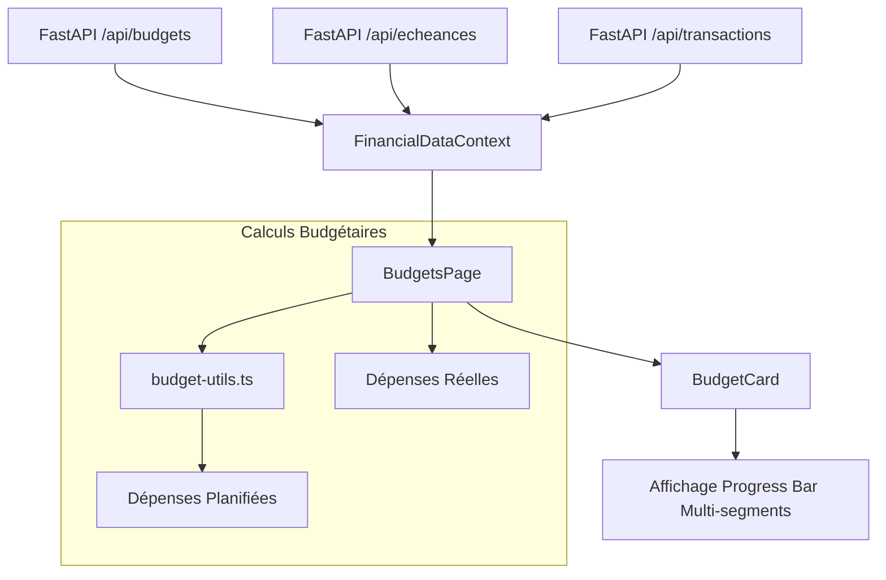

# Logic Flow — Budgets

Ce document décrit comment les données budgétaires et les prévisions sont gérées dans l'application.

## Flux de Données

## Description des Entrées/Sorties

### Entrées
- **Budgets** : Limites définies par catégorie (`id`, `categorie`, `montant_max`).
- **Transactions** : Dépenses réelles du mois en cours.
- **Échéances** : Dépenses récurrentes planifiées (`frequence`, `date_debut`, `montant`).

### Calcul des Prévisions
La fonction `calculatePlannedByTarget` dans `budget-utils.ts` :
1. Identifie les occurrences d'échéances pour le mois en cours.
2. Pour chaque occurrence, vérifie si une transaction réelle y est déjà associée (via `echeance_id`).
3. Si aucune transaction n'est associée, le montant est ajouté au "Prévu" (réservé) de la catégorie.

### Sortie UI
- **Consommé (Réel)** : Barre de couleur (Indigo/Jaune/Rouge).
- **Réservé (Prévu)** : Segment gris semi-transparent en queue de progression.
- **Dépassement Prévisionnel** : Alertes oranges si `Réel + Prévu > Limite`.
