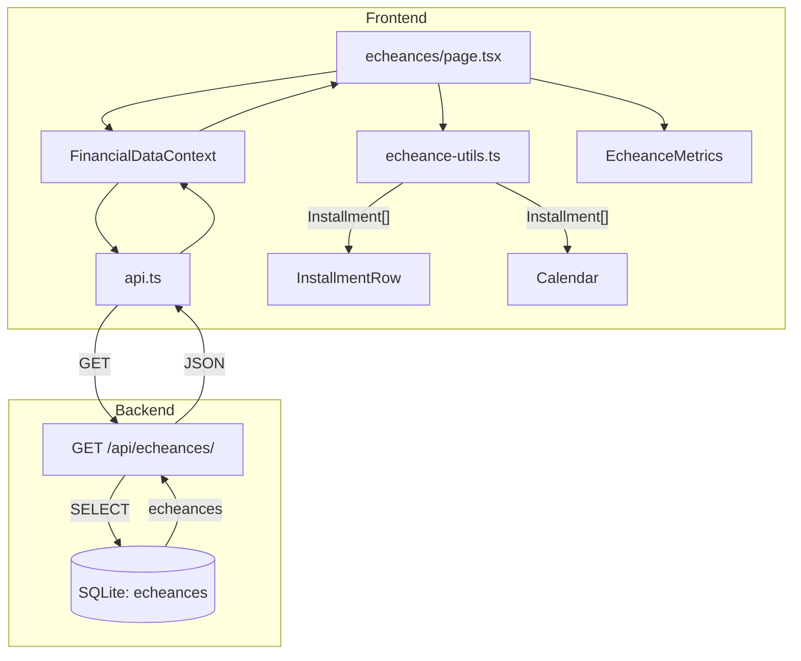

# Logic Flow — Échéances

## Fichiers concernés (imports directs)

```
frontend/src/app/echeances/
└── page.tsx                               # Page principale

frontend/src/context/
├── FinancialDataContext.tsx               # Context provider
└── ...

frontend/src/api.ts                        # Client API (getEcheances)

frontend/src/components/echeances/
├── echeance-types.ts                      # Types TypeScript + constantes de style
├── echeance-utils.ts                      # Fonctions de mapping (API → Installment)
├── echeance-row.tsx                       # Rendu d'une ligne de la liste
├── echeance-filters.tsx                   # Dropdowns de filtre et de tri
├── echeance-calendar.tsx                  # Calendrier avec points d'échéances
├── echeance-detail-modal.tsx               # Modal de détail
├── EcheanceMetrics.tsx                    # Métriques (dépensé, reste, cumulé)
└── SalaryPlanSetup.tsx                    # Configuration salary plan
```

## Arbre des dépendances

```
echeances/page.tsx
├── @/context/FinancialDataContext        (useFinancial)
│   └── api.getEcheances()                ← Source principale
│
├── @/components/echeances/echeance-utils.ts
│   └── mapEcheanceToInstallment()         (API → Installment)
│
├── @/components/echeances/echeance-row.tsx
├── @/components/echeances/echeance-filters.tsx
├── @/components/echeances/echeance-calendar.tsx
└── @/components/echeances/EcheanceMetrics.tsx
```

## Data Flow



## Source de données

| Source | API Endpoint | Usage |
|--------|--------------|-------|
| Échéances | `GET /api/echeances/` | Liste des échéances avec status (paid/pending/overdue) |
| Échéances calendrier | `GET /api/echeances/calendar` | Occurrences sur plusieurs mois |

### Format de réponse (EcheanceResponse)

```typescript
interface EcheanceResponse {
  id: string;                    // ID de l'échéance
  name: string;                  // description ou nom
  category: string;              // categorie
  sous_categorie?: string;       // sous-catégorie optionnelle
  amount: number;                // montant
  type: "expense" | "income";   // type de l'échéance
  status: "paid" | "pending" | "overdue";  // statut
  frequence: string;             // fréquence (mensuel, hebdomadaire, etc.)
  date_debut: string;            // date de début (ISO)
  date_fin?: string;             // date de fin (ISO)
  date_prevue: string;           // prochaine date prévue (ISO)
  daysRemaining: number;         // jours jusqu'à l'échéance
  paymentMethod: "automatic" | "manual";
}
```

## Statut des échéances

Le statut est calculé par le backend (`echeances.py`) :

1. **paid** : L'échéance a une transaction associée ce mois
2. **overdue** : `statut === 'active'` ET `date_prevue < today`
3. **pending** : `statut === 'active'` ET `date_prevue >= today`

**Important** : Les échéances 'paid' doivent être incluses dans les calculs car elles représentent des charges/revenus du mois en cours.

## Entrées → Sorties

| Étape | Données reçues | Données envoyées |
|-------|----------------|-------------------|
| `useFinancial()` | — | `{ echeances, ... }` |
| `mapEcheanceToInstallment(e)` | `EcheanceResponse` | `Installment` |
| `page.tsx` | `Installment[]` | Composants enfants |
| `InstallmentRow` | `Installment` | Rendu d'une ligne |
| `EcheanceMetrics` | `echeances`, `transactions` | Métriques (dépensé, reste, cumulé) |

## Effet Papillon

| Fichier modifié | Impact |
|-----------------|--------|
| `echeance-types.ts` | Tous les composants écheances |
| `echeance-utils.ts` | Qualité du mapping/affichage |
| `api.ts` (getEcheances) | Toutes les pages utilisant les échéances |
| `backend/api/echeances/` | Format des données, statut, calcul |

## Relations

- **Dashboard** → Affiche les prochaines échéances
- **Budgets** → Utilise les échéances pour le strategic balance
- **Transactions** → Liées aux échéances via `echeance_id`
