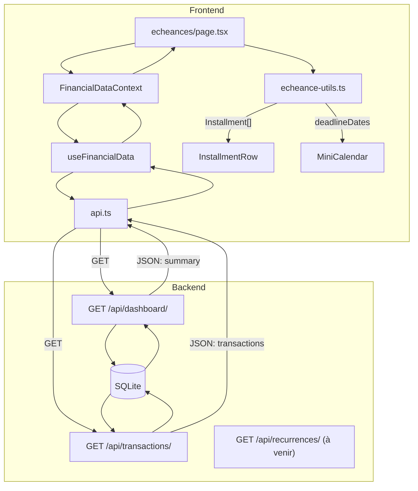

# Logic Flow — Échéances

## Fichiers concernés (imports directs)

```
src/app/echeances/
└── page.tsx                               # Page principale

src/context/
├── FinancialDataContext.tsx               # Context provider
└── useFinancial.ts                        # (réexport)

src/hooks/
└── useFinancialData.ts                    # Hook de fetching des données

src/api.ts                                 # Client API

src/components/echeances/
├── echeance-types.ts                      # Types TypeScript + constantes de style
├── echeance-utils.ts                      # Fonctions de mapping (API → Installment)
├── echeance-row.tsx                       # Rendu d'une ligne de la liste
├── echeance-filters.tsx                   # Dropdowns de filtre et de tri
└── mini-calendar.tsx                      # Mini-calendrier avec points d'échéances
```

## Arbre des dépendances

```
echeances/page.tsx
├── @/context/FinancialDataContext        (useFinancial)
│   └── useFinancialData.ts
│       └── api.ts  →  GET /api/dashboard/
│                   →  GET /api/transactions/
│
├── @/components/echeances/echeance-utils.ts
│   └── mapTransactionToInstallment()    (fallback si prochaines_echeances=[])
│   └── mapEcheanceToInstallment()       (données primaires depuis le backend)
│
├── @/components/echeances/echeance-row.tsx
├── @/components/echeances/echeance-filters.tsx
└── @/components/echeances/mini-calendar.tsx
```

## Data Flow



## Stratégie de données (priorité)

| Priorité | Source | Condition |
|----------|--------|-----------|
| 1 (Primaire) | `summary.prochaines_echeances` via `mapEcheanceToInstallment()` | Si `summary.prochaines_echeances.length > 0` |
| 2 (Fallback) | `transactions.slice(0, 20)` via `mapTransactionToInstallment()` | Sinon (backend en cours de config.) |

## API Endpoints

| Méthode | Endpoint | Usage |
|---------|----------|-------|
| `GET` | `/api/dashboard/` | Récupère `prochaines_echeances[]` (source primaire) |
| `GET` | `/api/transactions/` | Source de données fallback |
| `GET` | `/api/recurrences/` | **À créer par l'agent Backend** |

## Entrées → Sorties

| Étape | Données reçues | Données envoyées |
|-------|----------------|-----------------|
| `useFinancial()` | — | `{ summary, transactions, loading }` |
| `mapEcheanceToInstallment(e)` | `any` (raw API) | `Installment` |
| `mapTransactionToInstallment(t)` | `Transaction` | `Installment` |
| `page.tsx` | `Installment[]` | Composants enfants |
| `InstallmentRow` | `Installment` | Rendu d'une ligne |
| `MiniCalendar` | `deadlineDates: number[]` | Calendrier avec points |

## Effet papillon

**Si tu modifies...** → **Ça affecte...**

| Fichier modifié | Impact |
|-----------------|--------|
| `echeance-types.ts` | Tous les composants écheances |
| `echeance-utils.ts` | Qualité du mapping/affichage des données |
| `api.ts` (nouveau `getRecurrences`) | `page.tsx` (à mettre à jour en mode primaire) |
| `useFinancialData.ts` | Dashboard, Transactions, et Échéances |
| `FinancialDataContext.tsx` | Toutes les pages utilisant `useFinancial()` |
