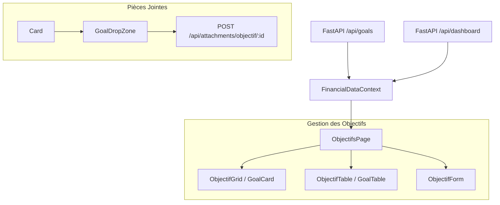

# Logic Flow — Objectifs (Goals)

Ce document décrit comment les objectifs financiers sont gérés, de la définition à la progression et l'archivage de documents.

## Flux de Données

## Description des Entrées/Sorties

### Entrées
- **Objectifs** : Liste des buts d'épargne (`id`, `nom`, `montant_cible`, `montant_actuel`, `date_cible`, `description`, `statut`).
- **Summary** : Utilisé pour récupérer la liste des catégories disponibles (via `repartition_categories`).

### État Global (Context)
Le `FinancialDataContext` expose :
- `objectifs` : Array d'objets `Objectif`.
- `objectifsLoading` : État de chargement.
- `setObjectif(data)` : Fonction d'upsert (POST si nouveau, PUT si existant).
- `deleteObjectif(id)` : Fonction de suppression.
- `showFinishedGoals` : Toggle UI pour filtrer les objectifs complétés.

### Logique de Progression
La progression est calculée directement dans les composants (`GoalCard`) :
- `Progress % = (montant_actuel / montant_cible) * 100`
- Un objectif est considéré comme **complété** si `montant_actuel >= montant_cible`.

### Pièces Jointes (Attachments)
Les objectifs servent de **hubs financiers** :
1. Le composant `GoalDropZone` (via `GoalCard`) permet de glisser-déposer des fichiers.
2. Les fichiers sont envoyés vers `/api/attachments/objectif/:id`.
3. Cela permet de lier des devis, factures ou preuves d'épargne directement au projet de vie.

## Filtres et Affichage
- **Toggle Global** : Un interrupteur en haut de page permet de masquer/afficher les objectifs dont la progression est à 100%.
- **Statistiques** : La page affiche des compteurs globaux (Total Cible, Total Épargné, Nombre de succès).
