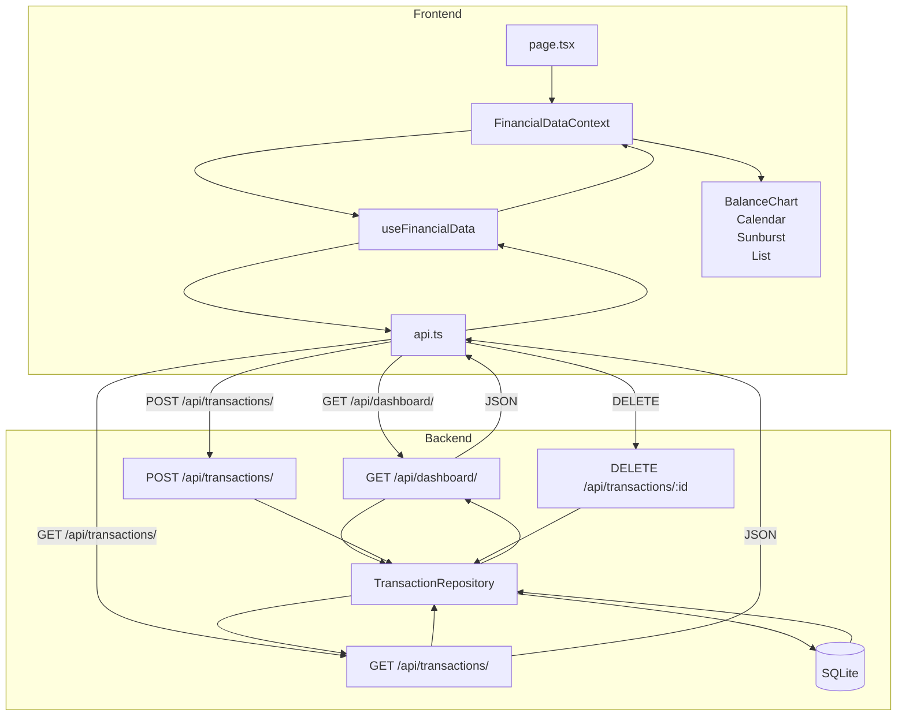

# Logic Flow — Transactions

## Fichiers concernés (imports directs)

```
src/app/transactions/
└── page.tsx                    # Page principale

src/context/
└── FinancialDataContext.tsx    # Context provider (et useFinancial)

src/hooks/
└── useFinancialData.ts         # Hook de fetching des données

src/api/
├── types.ts                  # Définitions des types
└── (autres basés sur api.ts)

src/components/transactions/
├── TransactionMetrics.tsx      # KPIs filtrés
└── TransactionDialogs.tsx      # Modales d'ajout/edit/suppr

src/components/dashboard/
├── balance-chart.tsx           # Graphique d'évolution
├── financial-calendar.tsx      # Calendrier financier
├── sunburst-chart.tsx          # Graphique sunburst
└── transaction-list.tsx        # Liste des transactions (utilisée ici)

src/lib/
├── utils.ts                    # Utilitaires (cn)
└── categories.ts               # Catégories (icons, colors)
```

## Arbre des dépendances complet

```
page.tsx
├── @/context/FinancialDataContext
│   └── useFinancialData.ts
│       └── @/api.ts (Agrégateur)
│           └── @/api/ (Services modulaires)
│
├── @/components/transactions/TransactionMetrics
├── @/components/transactions/TransactionDialogs
│
├── @/components/dashboard/balance-chart.tsx
├── @/components/dashboard/financial-calendar.tsx
├── @/components/dashboard/sunburst-chart.tsx
└── @/components/dashboard/transaction-list.tsx
```

## Data Flow



## API Endpoints

| Methode | Endpoint | Description |
|---------|----------|-------------|
| `GET` | `/api/dashboard/` | Résumé financier (totaux, catégories, historique) |
| `GET` | `/api/transactions/` | Liste toutes les transactions |
| `POST` | `/api/transactions/` | Ajouter une transaction |
| `DELETE` | `/api/transactions/:id` | Supprimer une transaction |

## Entrées → Sorties

| Étape | Données reçues | Données envoyées |
|-------|---------------|-----------------|
| `useFinancialData` | - | `{ summary, transactions, loading, apiStatus }` |
| `page.tsx` | `{ summary, transactions, loading }` | - |
| `BalanceChart` | `{ summary.historique }` | Graphique ligne |
| `FinancialCalendar` | `{ summary.historique }` | Calendrier |
| `SunburstChart` | `{ summary.repartition_categories }` | Graphique sunburst |
| `TransactionList` | `{ transactions, summary.repartition_categories }` | Liste avec filtres |

## Effet papillon

**Si tu modifies...** → **Ça affecte...**

| Fichier modifié | Impact |
|-----------------|--------|
| `api.ts` | Toutes les pages utilisant l'API |
| `useFinancialData.ts` | Dashboard, Transactions |
| `FinancialDataContext.tsx` | Toutes les pages utilisant `useFinancial()` |
| `balance-chart.tsx` | Transactions uniquement |
| `financial-calendar.tsx` | Transactions uniquement |
| `sunburst-chart.tsx` | Dashboard, Transactions |
| `transaction-list.tsx` | Transactions |
| `lib/utils.ts` | Tous les composants utilisant `cn()` |
| `lib/categories.ts` | Composants utilisant les catégories |