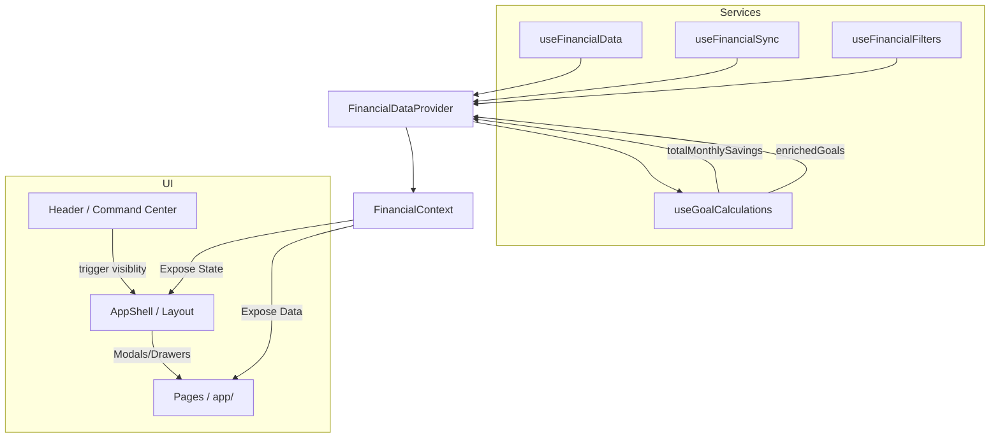

# Logic Flow — FinancialDataContext

Ce document décrit l'architecture du contexte global de l'application, qui sert de hub de données et de centre de commande pour toutes les actions financières.

## Architecture Modulaire

Pour respecter la règle de taille des fichiers (< 200 lignes), la logique du contexte est divisée en trois piliers :

1.  **`useFinancialData.ts` (Données Brutes)**
    *   Gère le chargement initial des transactions et du résumé.
    *   Expose les fonctions de mutation atomiques (add, update, delete transaction).
2.  **`useFinancialFilters.ts` (Filtrage Global)**
    *   Gère les états de filtrage (catégories, mois, recherche).
    *   Applique ces filtres sur les transactions brutes.
3.  **`useFinancialSync.ts` (Données Dérivées & Complexité)**
    *   Gère les entités secondaires : Échéances, Budgets, Objectifs, Salary Plans.
    *   Expose des méthodes de rafraîchissement groupées (`refreshAll`).
4.  **`useGoalCalculations.ts` (Métriques Stratégiques)**
    *   Calcule la capacité d'épargne réelle et enrichit les objectifs avec des projections temporelles.

## Diagramme de Flux d'Orchestration

## Rôles du Context

### 1. Hub de Données (Source of Truth)
Toutes les pages consomment les données via le hook `useFinancial()`. Cela garantit que si une transaction est ajoutée dans le Header, le solde du Dashboard et la liste des transactions sont mis à jour simultanément.

### 2. Gestion de la Visibilité (Modals & Plans)
Le contexte porte les états de visibilité des composants globaux :
- `isAddModalOpen` (Transactions)
- `isEcheanceModalOpen` (Échéances)
- `isSalaryPlanOpen` (Plan de Salaire / Budgets)
- `isSavingsPlanOpen` (Plan d'Épargne / Objectifs)

### 3. État d'Édition
Pour éviter de redéfinir des formulaires partout, le contexte stocke l'entité en cours d'édition (`editingTransaction`, `editingGoal`, etc.). L'`AppShell` réagit à ces changements pour afficher le formulaire approprié.

## Effet Papillon (Propagation)

Lorsqu'un **Salary Plan** est mis à jour :
1. `setSalaryPlan` est appelé.
2. `useFinancialSync` déclenche `refreshAll`.
3. Les données de `salaryPlans` changent.
4. `useGoalCalculations` recalcule automatiquement la **Capacité d'Épargne**.
5. Le **Plan d'Épargne** (`GoalSavingsConfig`) affiche la nouvelle capacité.
6. Le `PlanningSummary` (page budgets) met à jour ses jauges.
